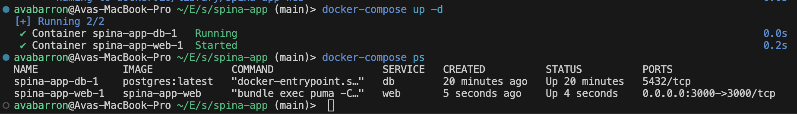

# README

This repo contains a minimal install of [SpinaCMS](https://spinacms.com/) using Docker.

## Setup

#### Pre-reqs

* Docker
* docker-compose
* postgres

### Easy setup

To run use the `run.sh` script in the root dir,

```bash
./run.sh
```

### Manual Setup

Alternatively to run manually, navigate to the `spina-app` dir and run the following,

```bash
docker-compose build
docker-compose up -d
```

### Troubleshooting

If you are running into errors try checking the docker-compose ps and/or logs.

```bash
docker-compose ps
docker-compose logs
```

### Default .env
Default `.env` file which belongs in `spina-app/spina-app` dir,
```bash
APP_HOME=/spina-app
RAILS_ENV=production
WEB_CONCURRENCY=4
RAILS_MAX_THREADS=5
POSTGRES_USER=spina_app
POSTGRES_PASSWORD=spina12345
POSTGRES_DB=spina_app_production
````

## Tools used

The tools used in this project are Docker, docker-compose, SpinaCMS and postgres.

## Challenges

Most of the challenges I faced revolved around setting up my dev env on my personal laptop becasue I didn't have Ruby installed (besides default system) and I had to set up rbenv and install bundler and all the tools for SpinaCMS locally to copy into my Docker image
Ex.

```bash
ruby 2.6.10p210 (2022-04-12 revision 67958) [universal.arm64e-darwin23]
avabarron@Avas-MacBook-Pro ~/E/spina-app> rbenv local 3.0.6
avabarron@Avas-MacBook-Pro ~/E/spina-app> rbenv rehash
avabarron@Avas-MacBook-Pro ~/E/spina-app> ruby -v
ruby 2.6.10p210 (2022-04-12 revision 67958) [universal.arm64e-darwin23]
set -gx PATH $HOME/.rbenv/shims HOME/.rbenv/shims$PATH
set -gx PATH /opt/homebrew/bin $PATH
avabarron@Avas-MacBook-Pro ~/E/spina-app> rbenv rehash
rbenv local 3.0.6
avabarron@Avas-MacBook-Pro ~/E/spina-app [1]> ruby -v
ruby 3.0.6p216 (2023-03-30 revision 23a532679b) [arm64-darwin23]
gem install bundler -v 2.5.18
rbenv rehash
```

Even after doing the above I still had issues with my Ruby version and had to install xcode etc and a newer version.


## Known Caveats and Potential Failure Scenarios

* **Environment Variables**: Ensure that environment variables for PostgreSQL credentials (`POSTGRES_USER`,`POSTGRES_PASSWORD`,`POSTGRES_DB`) are properly set in the`.env` file or your environment.
* **Docker Performance** : On certain systems, Docker performance might vary. If you encounter issues, check Docker’s resource allocation and system compatibility.
* **Dockerfile Optimizations**:
  Use a minimal base image to reduce attack surface and improve build times.
  Avoid running the container as the root user. Instead, use a non-root user, like nobody. Leverage multi-stage builds to keep the final img free of unnecessary build dependencies.
* **docker-compose.yml Adjustments**: use external volumes or managed storage services for persistent and stateful storage. Additionally, configure resources with limits.

### Installed and running



